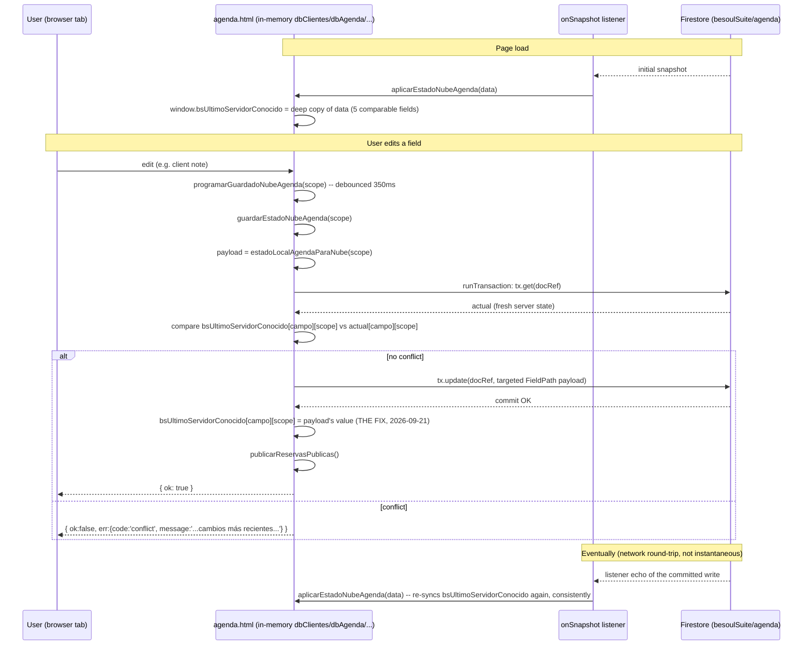
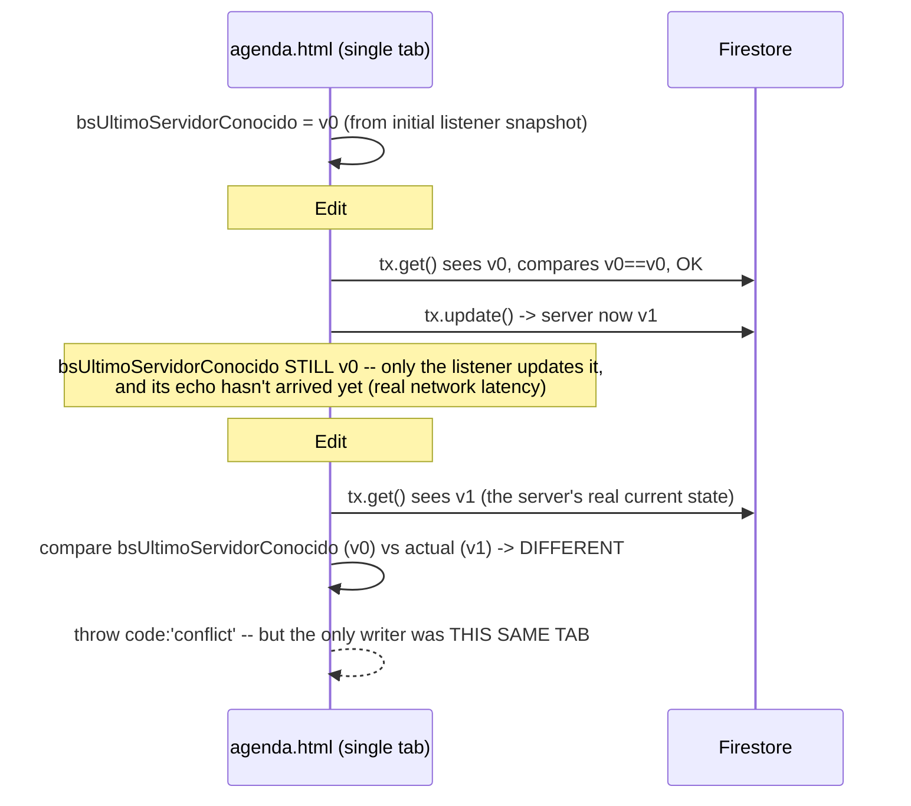
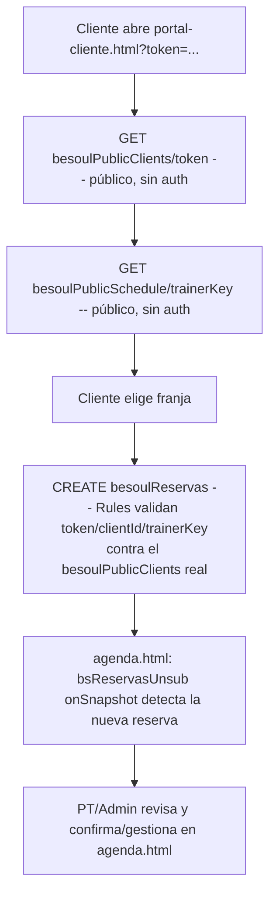
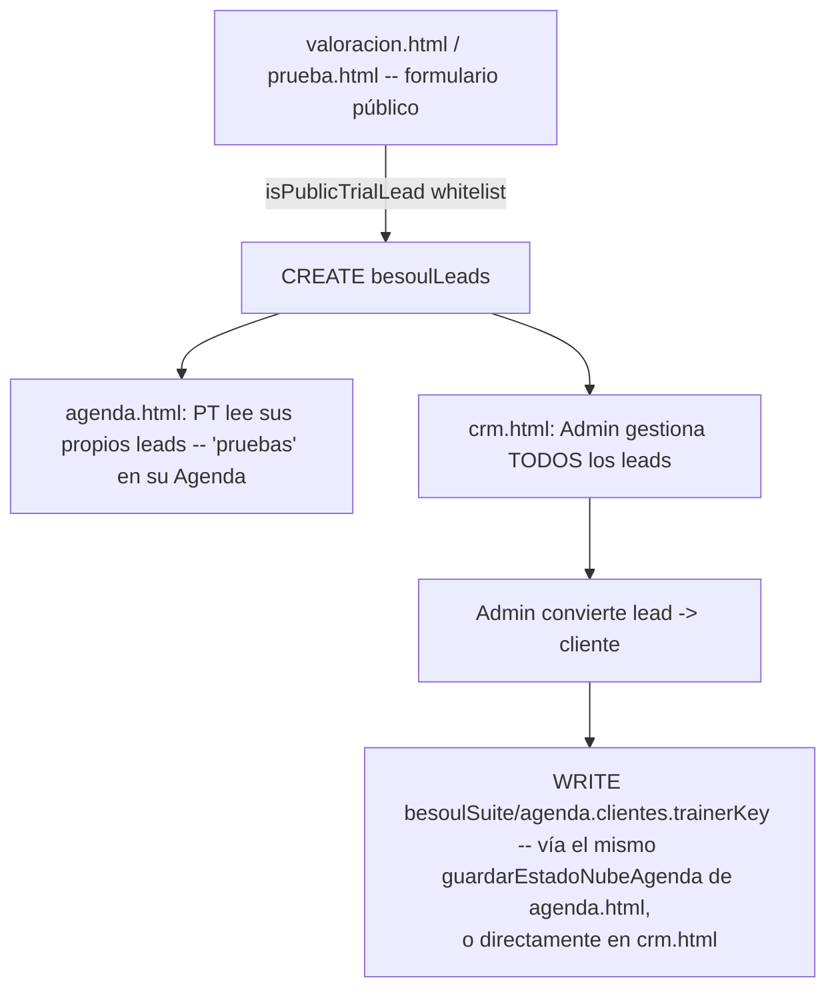
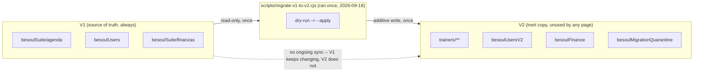
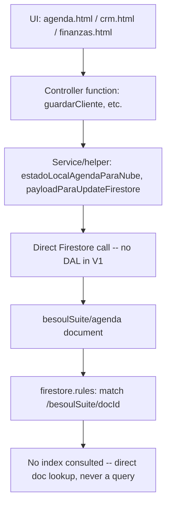

# BESOUL Data Flows

Companion to `BESOUL-SYSTEM-MAP.md` and `BESOUL-FIRESTORE-MAP.md`. Diagrams reflect the real code as
of `main` commit `72a31ed` (includes the 2026-09-21 save-conflict-race fix).

## Trainer save flow (the SAVE INCIDENT flow)



### Why the false conflict happened (before the 2026-09-21 fix)



## Admin "ver como PT" flow

```mermaid
flowchart TD
    Admin[Admin logs into agenda.html] --> Selector[Selector: elegir trainerKey a ver]
    Selector --> SetScope[entrenadorVisto = trainerKey elegido]
    SetScope --> Read[Lee besoulSuite/agenda -- documento COMPLETO, igual que un PT<br/>Firestore no tiene lectura parcial]
    Read --> Render[Renderiza SOLO la porción de ese trainerKey en memoria]
    Render --> Edit[Admin edita como si fuera ese PT]
    Edit --> Save[guardarEstadoNubeAgenda(entrenadorVisto)]
    Save --> Rule{Rules: isAdmin bypass}
    Rule -->|allowed, no trainerKey restriction| Write[tx.update -- misma transacción, mismo control de concurrencia que un PT]
```

## Portal booking flow (client-facing, no login)



## CRM lead → client conversion



## V1 → V2 (one-time additive copy, not a live sync)



## Layered view (generic, applies to every V1 write path)



For the equivalent V2 layered view (DAL-mediated, not yet connected to any UI), see
`BESOUL-SYSTEM-MAP.md` §3 and §6.
